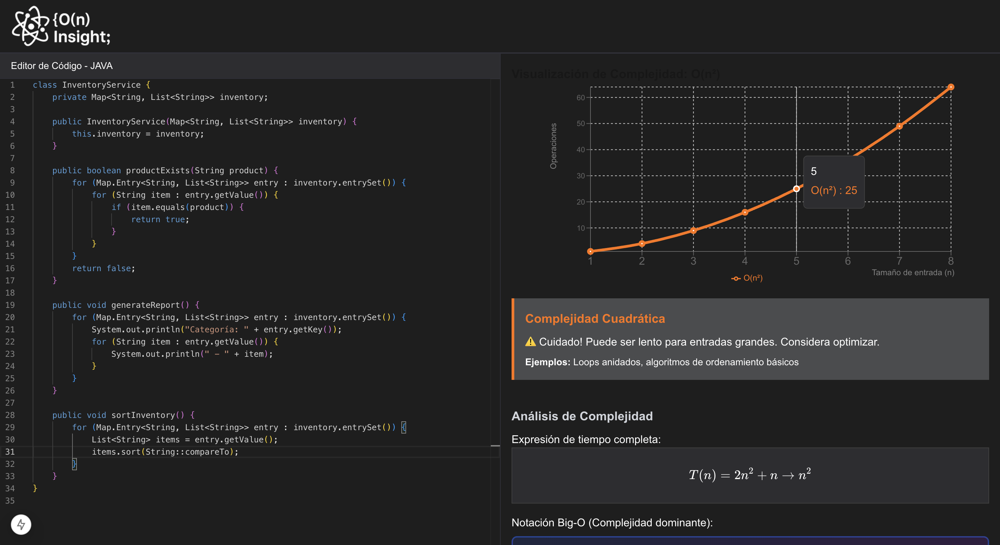

# 🚀 O(n) Insight - Analizador de Complejidad Algorítmica

<div align="center">



**Análisis inteligente de complejidad algorítmica para código Java en tiempo real**

[](https://nextjs.org)
[](https://reactjs.org)
[](https://www.typescriptlang.org)
[](https://microsoft.github.io/monaco-editor/)

</div>

## ✨ Características

- **🔍 Análisis Inteligente**: Detecta automáticamente patrones algorítmicos y calcula la complejidad Big-O
- **📊 Visualización Interactiva**: Gráficos dinámicos que muestran el crecimiento de diferentes complejidades
- **⚡ Tiempo Real**: Análisis con debounce de 3 segundos para una experiencia fluida
- **🧮 Renderizado Matemático**: Fórmulas LaTeX profesionales con KaTeX
- **📱 Diseño Responsivo**: Optimizado para desktop, tablet y móvil
- **🎯 Algoritmos Específicos**: Reconoce MergeSort, QuickSort, Fibonacci, BinarySearch y más
- **🌙 Tema Oscuro**: Interfaz moderna con tema VS Code

## 🛠️ Tecnologías Utilizadas

### Frontend
- **Next.js 15** - Framework de React con App Router
- **React 19** - Biblioteca de interfaz de usuario
- **TypeScript** - Tipado estático para JavaScript
- **Tailwind CSS** - Framework de CSS utilitario

### Editor y Visualización
- **Monaco Editor** - Editor de código VS Code integrado
- **Recharts** - Biblioteca de gráficos para React
- **KaTeX + react-katex** - Renderizado de matemáticas LaTeX

### Arquitectura
- **Hooks Personalizados** - Lógica reutilizable encapsulada
- **Separación de Responsabilidades** - Lógica de negocio separada de la vista
- **Componentes Modulares** - Arquitectura escalable y mantenible

## 🏗️ Arquitectura del Proyecto

```
src/
├── 📁 lib/                     # Lógica de negocio
│   ├── complexity/
│   │   ├── analyzer.ts         # Analizador principal de complejidad
│   │   ├── chartData.ts        # Datos y configuración de gráficos
│   │   └── types.ts            # Interfaces TypeScript
│   └── math/
│       └── latexConverter.ts   # Conversiones a LaTeX
├── 📁 hooks/                   # Hooks personalizados
│   ├── useComplexityAnalysis.ts  # Análisis con debounce
│   ├── useComponentLoading.ts    # Carga progresiva
│   ├── useWindowResize.ts        # Responsividad
│   ├── useChartDimensions.ts     # Dimensiones de gráficos
│   └── useLatexConversion.ts     # Conversiones matemáticas
└── 📁 app/                     # Componentes de UI
    ├── page.tsx                # Página principal
    ├── component/
    │   └── splash.tsx          # Pantalla de carga
    └── editor/
        ├── CodeEditor.tsx      # Editor Monaco
        ├── ComplexityChart.tsx # Gráfico de complejidad
        ├── MathFormula.tsx     # Fórmulas matemáticas
        └── [otros componentes] # Componentes modulares
```

## 🧠 Algoritmos Detectados

El analizador puede identificar y calcular la complejidad de:

### 🟢 **O(1) - Constante**
- Acceso a arrays por índice
- Operaciones aritméticas básicas

### 🟢 **O(log n) - Logarítmica**
- Búsqueda binaria
- Árboles balanceados
- Algoritmos divide y vencerás

### 🟡 **O(n) - Lineal**
- Recorrido de arrays
- Búsqueda lineal
- Un solo bucle

### 🟡 **O(n log n) - Lineal Logarítmica**
- **MergeSort** - Detecta patrones de división y conquista
- **QuickSort** - Identifica particionado con pivot
- **HeapSort** - Reconoce operaciones de heap

### 🟠 **O(n²) - Cuadrática**
- Bucles anidados
- Algoritmos de ordenamiento básicos
- Comparaciones de pares

### 🔴 **O(2^n) - Exponencial**
- **Fibonacci recursivo** - Detecta doble recursión
- Generación de subconjuntos
- Torres de Hanói

### 💀 **O(n!) - Factorial**
- Generación de permutaciones
- Problema del viajante (fuerza bruta)
- Algoritmos de backtracking completos

## 🚀 Instalación y Uso

### Prerrequisitos
- Node.js 18+ 
- npm, yarn, pnpm o bun

### Pasos de Instalación

1. **Clonar el repositorio**
```bash
git clone https://github.com/tu-usuario/on-insight.git
cd on-insight
```

2. **Instalar dependencias**
```bash
npm install
# o
yarn install
# o
pnpm install
```

3. **Ejecutar en modo desarrollo**
```bash
npm run dev
# o
yarn dev
# o
pnpm dev
```

4. **Abrir en el navegador**
```
http://localhost:3000
```

## 🎮 Cómo Usar

1. **Escribir Código**: Ingresa tu código Java en el editor Monaco
2. **Análisis Automático**: Espera 3 segundos y el análisis se ejecutará automáticamente
3. **Ver Resultados**: 
   - 📊 **Gráfico**: Visualización de la complejidad detectada
   - 🧮 **Fórmulas**: Expresión matemática y notación Big-O en LaTeX
   - 📝 **Información**: Descripción detallada y ejemplos

## 🧪 Ejemplos de Código

### MergeSort - O(n log n)
```java
public void mergeSort(int[] arr, int left, int right) {
    if (left < right) {
        int mid = (left + right) / 2;
        mergeSort(arr, left, mid);
        mergeSort(arr, mid + 1, right);
        merge(arr, left, mid, right);
    }
}
```

### Fibonacci - O(2^n)
```java
public int fibonacci(int n) {
    if (n <= 1) return n;
    return fibonacci(n-1) + fibonacci(n-2);
}
```

### Búsqueda Lineal - O(n)
```java
public int linearSearch(int[] arr, int target) {
    for (int i = 0; i < arr.length; i++) {
        if (arr[i] == target) return i;
    }
    return -1;
}
```

## 🔧 Scripts Disponibles

```bash
# Desarrollo
npm run dev          # Servidor de desarrollo

# Producción  
npm run build        # Construir para producción
npm run start        # Servidor de producción

# Calidad de código
npm run lint         # Linter ESLint
npm run type-check   # Verificación de tipos TypeScript
```

## 🎨 Características Técnicas

### Performance
- **Debounce de 3s** - Evita análisis innecesarios
- **Memoización** - Conversiones LaTeX optimizadas  
- **Lazy Loading** - Carga progresiva de componentes
- **Responsive Design** - Adaptable a cualquier pantalla

### Experiencia de Usuario
- **Splash Screen** - Carga elegante con animaciones
- **Editor Monaco** - Experiencia VS Code completa
- **Gráficos Interactivos** - Tooltip y zoom
- **Fórmulas LaTeX** - Renderizado matemático profesional

## 📱 Compatibilidad

- ✅ **Desktop**: Chrome, Firefox, Safari, Edge
- ✅ **Tablet**: iPad, Android tablets  
- ✅ **Móvil**: iOS Safari, Chrome Mobile
- ✅ **Responsive**: Breakpoints optimizados

## 🤝 Contribuciones

Las contribuciones son bienvenidas! Por favor:

1. Fork el proyecto
2. Crea una rama para tu feature (`git checkout -b feature/AmazingFeature`)
3. Commit tus cambios (`git commit -m 'Add: AmazingFeature'`)
4. Push a la rama (`git push origin feature/AmazingFeature`)
5. Abre un Pull Request

## 📄 Licencia

Este proyecto está bajo la Licencia MIT. Ver `LICENSE` para más detalles.

## 🙏 Agradecimientos

- **Monaco Editor** - Por el increíble editor de código
- **Recharts** - Por las visualizaciones elegantes
- **KaTeX** - Por el renderizado matemático
- **Next.js Team** - Por el excelente framework
- **Tailwind CSS** - Por el sistema de diseño

---

<div align="center">

**¿Te gustó el proyecto? ¡Dale una ⭐ en GitHub!**

Desarrollado con ❤️ para la comunidad de desarrolladores

</div>
